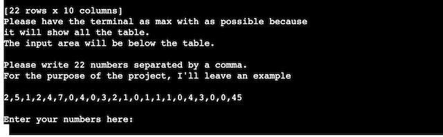

# The Food House Stack App

## Introduction

  The Food House Stack App was created to have better control over food storage and to calculate a budget for the next shopping.
  It is connected to google sheets; for that reason, a google account is required.
  The client supplied all the information, for example, the product he wanted to buy and add to the list, their corresponding price, and the amount in storage. He hired me to make themathematical equation possible to see the budget weekly without needing extra input.

## How to use the app.

  The spreadsheet consists of three tabs: stack, remain, and budget.
  1. Stock worksheet: This tab shows the provided product information by the user before. It is the only tab the user must modify manually since, with the help of this tab, the othertwo will be updated thanks to a mathematical equation automatically. The user must fill the column "used per week" out with the number of portions he might use for the week.
  2. Remain: The user would not have to enter any information in this worksheet. The tab "remain" has been created to subtract the number of portions in storage from the number ofportions used per week, so the user can identify when he has few portions in storage left or is out of stock. When the number has a negative sign before, it means that the user hasnothing left, and he might buy the amount in storage + the number of portions that he might use in the week, so he avoids the negative numbers for the next week again.
  3. Budget: this worksheet shows the weekly budget for the shopping based on the information entered on the tab "Stock." The budget will be calculated and displayed in the column"Budget per week." It uses the number of portions per product multiplied by the number of portions used per week by the price and then divided between the content of the package. Theresults are the budget the user might consider for shopping the following week. This tab doesn't need to be modified by the user either.

## Features

- ### Existing features.

  - The app will begin by welcoming the user and asking if the user wishes to start giving two options: "yes" or "no."
  - If the user does not wish to continue, he might type "no," and then the session on the app will end.

    
    

  - It has a validation system to enter the correct data required. Otherwise, it will print an error.

    

  - In the terminal, the table will be printed to have the products as a reference.
  - The information on the table will be erased every time the app opens to update the new data.

    

  - There is a section with instructions to guide the user.

    

  - It will provide feedback that the corresponding cells were successfully updated.

    

### Possible Features.

  - Entering the data daily for further accuracy of the data.
  - Change the color of the numbers to red color in the google sheet when they are negative.
  - Combining the app with supermarkets also to create a list.
  - To make a complete household, not only for food but also for detergents, etc.

## Data model:

- To develop the app, I used Gspread and Pandas for external libraries. Gspread was used to communicate with the spreadsheet, updating and accessing the cells. Pandas were used tocreate a Dataframe and access the information through the columns, which was impossible through Gspread or, as far as my knowledge goes.
- I considered the workflow from Code Institute and Youtube videos, which will be mentioned in the credits.

  

## Testing

- I tested the project constantly with the following:
  - Print a statement every time a function is created.
  - I placed invalid inputs to check the validation function when needed.
  - I passed the code through a PEP8 linter and confirmed no problems.
  - Used [Python tutor](https://pythontutor.com/cp/composingprograms.html#mode=edit).

## Bugs:

### Solved:

1.  The values from my CSV file came empty. The solution was to create a new CSV file and a new repository.
2.  The table was printing the wrong values. The solution was to use this statement <code>pd.dataframe(value.get all records)</code>
3.  For the estimated budget, the number from the stock sheet was retrieved as int and converted to float; it added a ",0". The solution was changing the google sheet formats and dividing by 10 with Python.
4.  Infinite loop with the welcome_app function. Solution. Taking the function out of main() and placing the welcome app function.
5.  By creating a new function to print the instructions and the table, the table cells were not clearing. I put the print table statement in the main function to solve this bug.

### There are no remaining bugs.

## Validator testing

- PEP8:
  - 86: E501 line too long (90 > 79 characters)
  - 144: E501 line too long (100 > 79 characters)
  - 150: E501 line too long (82 > 79 characters).
- The three errors mentioned above are due to the print statement being too long, but indented will throw a logical error.

## Deployment:

- This project was deployed using Code Institutes moch terminal for Heroku.
- For the deployment were needed the following steps were:
  1. Use Code Institutes template cloned from their repository.
  2. Create an account with Heroku, and afterward an app.
  3. Sed the buildbacks <code> Python</code> and <code>NodeJS</code> in that order.
  4. In the Automatic deploys area, enable the automatic deployment.
  5. At the top of the web page, click the open app button.

## Credit.

- For the use of Pandas library I used:
  - [Pandas](https://pandas.pydata.org/docs/dev/getting_started/intro_tutorials/06_calculate_statistics.html).
  - [Youtube video](https://www.youtube.com/watch?v=O62iYyQYtrY&list=PLYNEIMg6-4sZ0rdeQ_wIgKzLXKEnpAHGF&index=3).
- For the use of Gspread:
  - [Gspread](https://docs.gspread.org/en/latest/)
  - Code Institute modules
- For the workflow:
  - Code Institue modules
- The manipulation of Google Sheets:
  - [Google developers](https://developers.google.com/sheets/api/reference/rest/v4/spreadsheets/cells#cellformat)
- The update function:
  - I made it together wiht Code Institute tutor.
